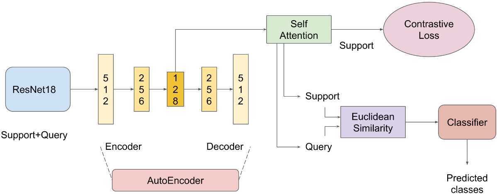

## Group-Name: 69-Friday

## Few Shot Learning(FSL)
We implement few shot learning for image classification and perform analysis on it. 

FSL is implemented on Caltech-UCSD Birds-200-2011 dataset:[link](http://www.vision.caltech.edu/visipedia/CUB-200-2011.html)

We vary N and K for N-way K-shot model to test the effect of N and K on our model architecture. More details in the report.pdf

## Model Architecture
The model pipeline is designed by us and is an amalgamation of different techniques we have come acrosss.

## References:    
a. https://towardsdatascience.com/few-shot-learning-with-prototypical-networks-87949de03ccd?gi=7937389e2697  
b. https://www.analyticsvidhya.com/blog/2021/05/an-introduction-to-few-shot-learning/#:~:text=Few%2Dshot%20learning%20is%20the,generalize%20to%20the%20test%20set.  
c. http://www.vision.caltech.edu/visipedia/CUB-200-2011.html  
d. https://sicara.ai/blog/your-few-shot-model-15mn-pytorch  
e. https://blog.floydhub.com/n-shot-learning/  
f. https://www.kaggle.com/code/iamleonie/few-shot-learning-tutorial-1-n-way-k-shot/notebook  
g. https://github.com/MegviiDetection/FSCE  
h. https://github.com/sicara/easy-few-shot-learning   
i. https://github.com/YapengTian/AVVP-ECCV20/blob/master/nets/net_audiovisual.py#L38  
 

## Code base link : [link](https://drive.google.com/drive/folders/1BJKLY5dsVoJpCBg1Ecw2XkI1pYf9skWa?usp=sharing)
	   	
**Guide how to run code on colab (use above code base):**
1) Download i.pynb file shared from above code base link and also data set (as we can't share drive access to everyone).
2) Go to cell number 4 and change 'N=5' and 'K=5' and mode= 'test' or 'train' as per you aim 
   your cell no. 4 for training should look like ----> args = "--model-name [model_name] --N 5 --K 5 --mode [train|test]" look for help in argparser
3) Finally go to runtime change it to 'GPU' and run all cells.

**For running with terminal (use git code base)**

Refer to argparser, modify paths in dataloader to relative utils path.  
There is an example command in the train.py file.
